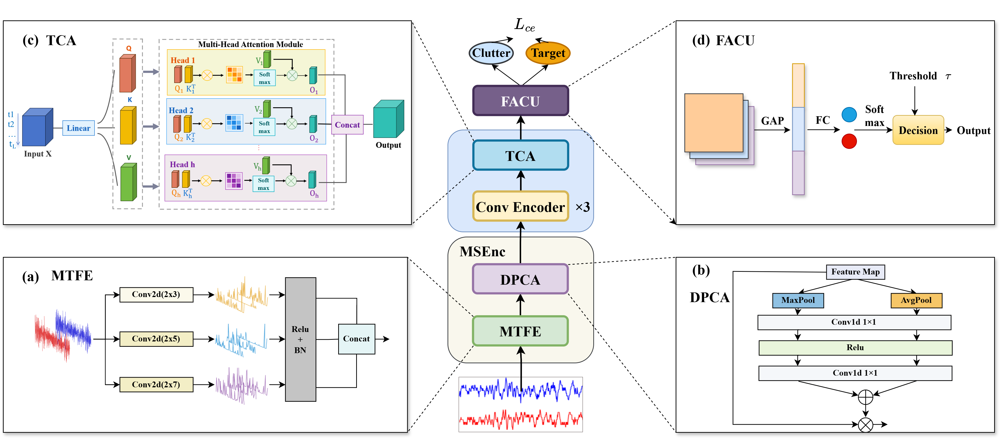

# Echo2Det

## Doing More with Less: Echo2Det for Sea-Surface Small-Target Detection

**Yaxin Peng, Jiaji Chen, Hongyu Wei, Mengjie Wu, Ruijie Chen**

*IEEE Transactions on Aerospace and Electronic Systems (TAES), 2026*

## Overview

Echo2Det is a lightweight end-to-end detector for sea-surface small targets that operates directly on raw complex I/Q echoes, without signal-to-image conversion. Its Multi-scale Subspace Encoding (MSEnc) module extracts complementary temporal representations and reweights informative components, while Temporal Context Aggregation (TCA) captures longer-range temporal dependencies. Together, these modules form a compact signal-level architecture for sea-surface small-target detection under low-false-alarm operating conditions.



## Method Overview

The network first uses MSEnc to combine multi-scale temporal features and dual-pool channel attention. TCA then aggregates temporal context with lightweight multi-head attention. A compact False Alarm Control Unit (FACU) produces the final clutter/target decision.

## Repository Structure

```text
.
├── model/
│   └── Echo2Det.py
├── assets/
│   └── overall_network.png
├── README.md
├── LICENSE
└── .gitignore
```

## Installation

Install a compatible version of [PyTorch](https://pytorch.org/).

## Usage

The model can be imported and run with an input tensor shaped as `(batch, 1, 2, 1024)`:

```python
import torch
from model.Echo2Det import Echo2Det

model = Echo2Det()
x = torch.randn(1, 1, 2, 1024)
logits = model(x)
```

The output has shape `(batch, 2)` for the default two-class configuration.

## Citation

```bibtex
@article{peng2026echo2det,
  title   = {Doing More with Less: Echo2Det for Sea-Surface Small-Target Detection},
  author  = {Peng, Yaxin and Chen, Jiaji and Wei, Hongyu and Wu, Mengjie and Chen, Ruijie},
  journal = {IEEE Transactions on Aerospace and Electronic Systems},
  year    = {2026},
  note    = {Accepted}
}
```

## License

This repository is released under the [MIT License](LICENSE).
